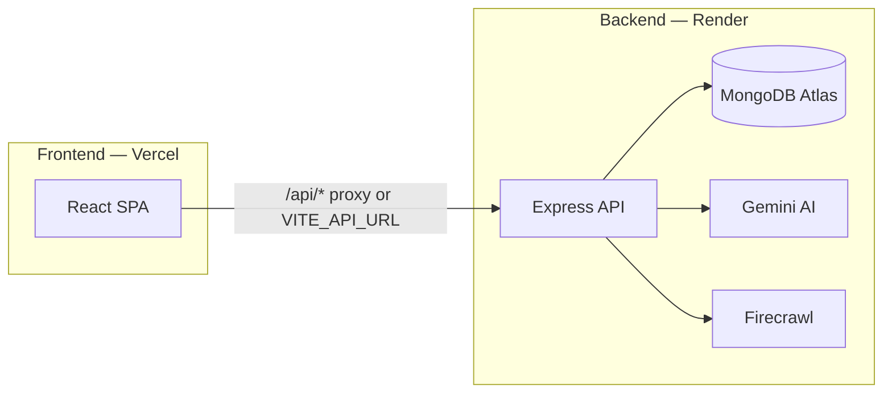
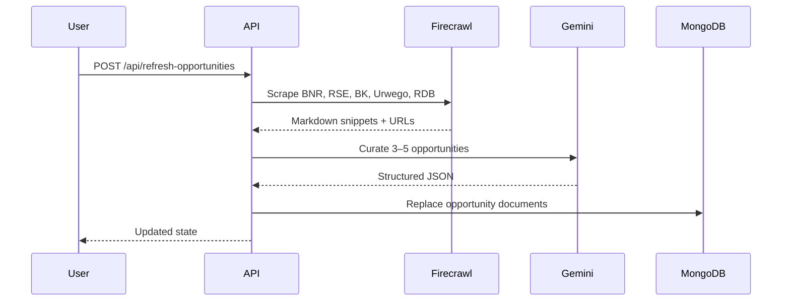

# Terura

**Terura** is a bilingual (English / Kinyarwanda) cooperative savings and growth platform for informal savings groups (*Ikimina*) in Rwanda. Members save and borrow within their group; committee admins review loan requests and investment opportunities curated from live Rwanda finance sources.

Built as a **MERN monorepo**: React frontend (Vite) + Express/MongoDB backend, deployable to **Vercel** (frontend) and **Render** (API).

---

## Table of Contents

- [Features](#features)
- [Architecture](#architecture)
- [Tech Stack](#tech-stack)
- [Project Structure](#project-structure)
- [Prerequisites](#prerequisites)
- [Local Development](#local-development)
- [Authentication & Roles](#authentication--roles)
- [Environment Variables](#environment-variables)
- [Production Deployment](#production-deployment)
- [API Reference](#api-reference)
- [Opportunity Pipeline](#opportunity-pipeline)
- [Scripts](#scripts)
- [Troubleshooting](#troubleshooting)

---

## Features

### Members
- **Sign In**, **Join**, and **Committee** login tabs (phone + 4-digit PIN)
- Savings dashboard with balance, contributions, and loan requests
- Savings history with trend visualization
- Personalized financial tips (Google Gemini)
- Bilingual UI toggle (EN / RW) on every screen
- Profile settings, optional dark mode
- Friendly error messages (wrong PIN, account not found, server unavailable)

### Committee / Admin
- Group overview: total savings, active loans, member count
- Register members (Member or Committee Admin role)
- Loan approvals queue (approve / decline)
- Smart Opportunity Feed — Firecrawl scrapes Rwanda finance sites, Gemini curates options
- Flag opportunities for group vote; AI risk analysis per card
- Group savings charts on admin dashboard

---

## Architecture



**Local dev:** Vite proxies `/api` → `http://localhost:5000`.

**Production (recommended):** Vercel rewrites `/api/*` to your Render URL via `BACKEND_URL` at build time. No CORS issues, no client env var required.

**Production (alternative):** Set `VITE_API_URL` to your Render URL and configure `FRONTEND_URL` on the backend (no trailing slash).

---

## Tech Stack

| Layer | Technologies |
|-------|-------------|
| **Frontend** | React 19, Vite 6, Tailwind CSS v4, Lucide icons |
| **Backend** | Express, MongoDB (Mongoose), JWT, bcrypt |
| **AI** | Google Gemini (`gemini-2.5-flash` with model fallback) |
| **Web data** | Firecrawl (BNR, RSE, Bank of Kigali, Urwego Finance, RDB) |
| **Deploy** | Vercel (frontend), Render (backend), MongoDB Atlas |

---

## Project Structure

```
terura/
├── frontend/
│   ├── src/
│   │   ├── components/       # Screens, Login, EmptyState, UserNotice
│   │   ├── lib/
│   │   │   ├── api.ts        # JWT client, safe JSON parsing
│   │   │   └── userMessages.ts  # Bilingual user-facing errors
│   │   ├── generated/        # Build-time API proxy flag (Vercel)
│   │   ├── App.tsx
│   │   └── types.ts
│   ├── scripts/
│   │   └── generate-vercel-config.mjs  # Injects /api proxy on build
│   ├── vercel.json
│   └── .env.example
├── backend/
│   ├── src/
│   │   ├── config/           # DB, Rwanda finance source URLs
│   │   ├── models/           # Mongoose schemas
│   │   ├── routes/           # REST API
│   │   ├── services/         # gemini, firecrawl, geminiClient
│   │   ├── seed/             # Empty cooperative seeder
│   │   ├── middleware/       # JWT auth
│   │   └── index.ts
│   ├── scripts/
│   │   └── probe-ai.ts       # Local Gemini + Firecrawl health check
│   └── .env.example
├── render.yaml               # Render Blueprint
├── package.json              # npm workspaces root
└── README.md
```

---

## Prerequisites

- **Node.js** 20+ (backend pins `20.x` for Render)
- **MongoDB** — [MongoDB Atlas](https://www.mongodb.com/atlas) free tier recommended
- **Gemini API key** — [Google AI Studio](https://aistudio.google.com/apikey) (starts with `AIza...`)
- **Firecrawl API key** — [firecrawl.dev](https://firecrawl.dev) (optional; falls back to Gemini-only)
- **Git** + GitHub for deployment

---

## Local Development

### 1. Install dependencies

```bash
npm install
```

### 2. Configure backend

```bash
cp backend/.env.example backend/.env
```

Edit `backend/.env`:

```env
PORT=5000
MONGODB_URI=mongodb+srv://...
JWT_SECRET=your-long-random-secret
GEMINI_API_KEY=AIza...
FIRECRAWL_API_KEY=fc-...
FRONTEND_URL=https://terura.vercel.app
ADMIN_PHONE=0788123456
```

| Variable | Purpose |
|----------|---------|
| `MONGODB_URI` | MongoDB connection string |
| `JWT_SECRET` | Signs session tokens — use a long random string in production |
| `GEMINI_API_KEY` | Financial tips and opportunity curation |
| `FIRECRAWL_API_KEY` | Live scrape of Rwanda finance sources |
| `FRONTEND_URL` | CORS allowed origin (no trailing slash) |
| `ADMIN_PHONE` | Phone number allowed for first committee bootstrap |
| `GEMINI_MODEL` | Optional override (default tries `gemini-2.5-flash` first) |

### 3. Seed the database

Creates an empty cooperative named **Terura** — no demo users:

```bash
npm run seed
```

### 4. Start dev servers

```bash
npm run dev
```

| Service | URL |
|---------|-----|
| Frontend | https://terura.vercel.app |
| Backend | https://terura.onrender.com |
| Health check | http://localhost:5000/health |

Leave `frontend/.env` empty locally — Vite proxies `/api` to the backend automatically.

---

## Authentication & Roles

### Login screen tabs

| Tab | Fields | API | Behavior |
|-----|--------|-----|----------|
| **Sign In** | Phone + PIN | `POST /api/login` `{ mode: "login" }` | Existing members only — no auto-register |
| **Join** | Name + Phone + PIN | `POST /api/login` `{ mode: "register" }` | Creates a member account |
| **Committee** | Phone + PIN | `POST /api/login/admin` | Admin role only |

### First-time committee setup

1. Set `ADMIN_PHONE` in `backend/.env` to the committee phone number.
2. Run `npm run seed` if the database is empty.
3. Open **Committee** tab → **First-time committee setup**.
4. Register with that phone, your name, and a PIN.

After bootstrap, add more admins from **Admin Dashboard → Register Member** (role: Committee Admin).

### Session

- JWT stored in `localStorage` as `terura_token`
- Protected routes require `Authorization: Bearer <token>`
- Language preference persists per user (logged in) or cooperative default (logged out)

---

## Environment Variables

### Backend (`backend/.env`)

See [backend/.env.example](backend/.env.example).

### Frontend (`frontend/.env`)

Only needed for production overrides. See [frontend/.env.example](frontend/.env.example).

| Variable | When | Example |
|----------|------|---------|
| `BACKEND_URL` | Vercel build (recommended) | `https://terura.onrender.com` |
| `VITE_API_URL` | Direct API calls (optional) | `https://terura.onrender.com` |

**Do not** add trailing slashes to URLs.

---

## Production Deployment

### Overview

1. Deploy **backend** to Render → get API URL  
2. Deploy **frontend** to Vercel with `BACKEND_URL`  
3. Set `FRONTEND_URL` on Render to your Vercel domain  
4. Seed production DB once  

---

### Backend — Render

**Option A: Blueprint** — Render Dashboard → New → Blueprint → connect repo (`render.yaml` included).

**Option B: Manual Web Service**

| Setting | Value |
|---------|--------|
| Root Directory | `backend` |
| Build Command | `npm install && npm run build` |
| Start Command | `npm run start` |
| Health Check | `/health` |

**Environment variables (Render):**

```env
MONGODB_URI=mongodb+srv://...
JWT_SECRET=<long-random-string>
GEMINI_API_KEY=AIza...
FIRECRAWL_API_KEY=fc-...
FRONTEND_URL=https://your-app.vercel.app
ADMIN_PHONE=0788123456
GEMINI_MODEL=gemini-2.5-flash
```

**Seed production database** (Render Shell):

```bash
npm run seed
```

**Verify:** `https://your-api.onrender.com/health` → `{ "status": "ok" }`

---

### Frontend — Vercel

1. Import repo → set **Root Directory** to `frontend`
2. Add environment variable:

   ```env
   BACKEND_URL=https://your-api.onrender.com
   ```

3. Deploy (build runs `prebuild` which injects `/api/*` proxy into `vercel.json`)

**CLI:**

```bash
cd frontend
vercel
vercel env add BACKEND_URL production
vercel --prod
```

**Alternative:** Set `VITE_API_URL` instead of `BACKEND_URL` to call Render directly. Requires correct `FRONTEND_URL` on backend for CORS.

---

### Post-deploy checklist

- [ ] `https://your-api.onrender.com/health` returns OK  
- [ ] `https://your-api.onrender.com/api/ai/status` shows Gemini + Firecrawl status  
- [ ] `FRONTEND_URL` on Render = `https://your-app.vercel.app` (no trailing slash)  
- [ ] `BACKEND_URL` on Vercel = Render URL (no trailing slash)  
- [ ] Committee bootstrap or member registration works  
- [ ] Language toggle works while logged in and on login screen  

---

## API Reference

| Method | Endpoint | Auth | Description |
|--------|----------|------|-------------|
| GET | `/health` | — | Service health check |
| GET | `/api/state` | Optional | Full application state |
| GET | `/api/ai/status` | — | Gemini + Firecrawl key health |
| GET | `/api/auth/status` | — | `{ hasAdmin: boolean }` |
| POST | `/api/login` | — | Sign in or register (`mode: login \| register`) |
| POST | `/api/login/admin` | — | Committee sign-in |
| POST | `/api/logout` | JWT | End session |
| POST | `/api/language` | Optional | Set EN/RW preference |
| POST | `/api/add-member` | Admin | Register member or admin |
| POST | `/api/update-profile` | JWT | Update member name |
| POST | `/api/save` | JWT | Savings deposit |
| POST | `/api/request-loan` | JWT | Submit loan request |
| POST | `/api/approve-loan` | Admin | Approve loan |
| POST | `/api/decline-loan` | Admin | Decline loan |
| POST | `/api/repay-loan` | JWT | Repay approved loan |
| POST | `/api/generate-tip` | JWT | AI financial tip |
| POST | `/api/refresh-opportunities` | JWT | Firecrawl + Gemini opportunity refresh |
| POST | `/api/analyze-opportunity` | JWT | AI risk analysis for one opportunity |
| POST | `/api/flag-opportunity` | JWT | Flag for group vote |

---

## Opportunity Pipeline



- Scraped sources live in `backend/src/config/rwandaSources.ts`
- Without `FIRECRAWL_API_KEY`, Gemini generates opportunities from known Rwanda institutions (degraded mode)
- Cards show clickable `sourceUrl` when available from scraped data

**Local AI health check:**

```bash
cd backend && npx tsx scripts/probe-ai.ts
```

---

## Scripts

| Command | Description |
|---------|-------------|
| `npm run dev` | Start frontend + backend concurrently |
| `npm run seed` | Reset MongoDB to empty Terura cooperative |
| `npm run build` | Build frontend for production |
| `npm run start` | Start production backend (`node dist/index.js`) |
| `npm run lint` | Type-check frontend and backend |

---

## Troubleshooting

### CORS blocked on Vercel

**Symptom:** `Access-Control-Allow-Origin` mismatch.

**Fix:** Set `FRONTEND_URL=https://your-app.vercel.app` on Render — **no trailing slash**. Redeploy Render after the CORS normalization fix in `backend/src/index.ts`.

**Alternative:** Remove `VITE_API_URL` on Vercel and use `BACKEND_URL` only (same-origin proxy).

### 405 on `/api/login`

**Symptom:** POST returns 405, HTML instead of JSON.

**Cause:** Vercel SPA rewrite catching `/api` without a backend proxy.

**Fix:** Set `BACKEND_URL` on Vercel and redeploy with cache cleared.

### Render build fails with `Unknown command: "build"`

**Fix:** Build command must be `npm install && npm run build` (not `npm build`).

### Gemini quota / invalid key

**Symptom:** Opportunities or tips fail; check `GET /api/ai/status`.

**Fix:**
- Use a key from [Google AI Studio](https://aistudio.google.com/apikey) (`AIza...`)
- Set `GEMINI_MODEL=gemini-2.5-flash` on Render
- Wait for free-tier quota reset or enable billing

### Language toggle logs user out

**Fixed:** Language API sends JWT when logged in. Logged-out toggles use `auth: false` and update cooperative default language.

### MongoDB connection on Windows

If Atlas SRV lookup fails, the backend uses public DNS (`8.8.8.8`, `1.1.1.1`) in `backend/src/config/db.ts`.

---

## Design System

| Token | Value | Usage |
|-------|-------|-------|
| Background | `#FAF9F6` | App surface |
| Primary | `#1F5C3F` | Buttons, active nav |
| Accent | `#C9A227` | Committee tab, highlights |
| Headings | DM Sans | Bold / Medium |
| Body | Poppins | Regular / Medium |
| Radius | `rounded-xl` | Cards, buttons, inputs |

Layout: mobile-first with bottom navigation (members) and sidebar (admin/desktop).

---

## License

Private project — Terura cooperative savings platform.
